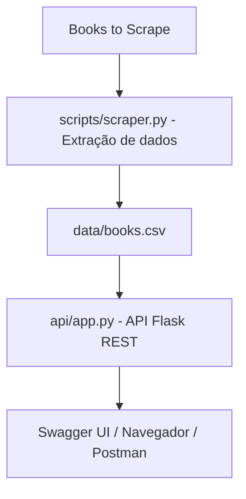

# API Pública de Consulta de Livros

Projeto desenvolvido para o **Tech Challenge – Fase 1** do curso de **Pós-Graduação em Machine Learning Engineering – FIAP**.

---

## Descrição do Projeto

A aplicação realiza **web scraping** do site [Books to Scrape](https://books.toscrape.com/), extrai informações dos livros e disponibiliza os dados por meio de uma **API RESTful**.

O pipeline é composto por:

1. Extração automatizada de dados (web scraping com BeautifulSoup).
2. Armazenamento em CSV local.
3. Disponibilização dos dados via API Flask.
4. Autenticação JWT para rotas sensíveis.
5. Documentação automática com Swagger (Flask-RESTx).
6. Endpoints prontos para integração com modelos de Machine Learning.

---

## Estrutura de Pastas

```
tech_challenge_fase1/
│
├── api/
│   ├── app.py
│
├── data/
│   ├── books.csv
│
├── scripts/
│   ├── scraper.py
│
├── .env.example
├── config.py
├── README.md
└── requirements.txt
```

---

## Instalação e Execução

### 1️⃣ Clonar o Repositório
```bash
git clone https://github.com/algmoraes01/fiap-books-api.git
cd fiap-books-api
```

### 2️⃣ Criar Ambiente Virtual
```bash
python -m venv venv
```

### 3️⃣ Ativar o Ambiente

* **Windows:**
  ```bash
  venv\Scripts\activate
  ```
* **Mac/Linux:**
  ```bash
  source venv/bin/activate
  ```

### 4️⃣ Instalar Dependências
```bash
pip install -r requirements.txt
```

### 5️⃣ Executar o Scraper
```bash
python scripts/scraper.py
```

### 6️⃣ Executar a API
```bash
python -m api.app
```

Acesse no navegador:  
[http://localhost:5000](http://localhost:5000)

---

## Documentação Swagger

Após iniciar o servidor, acesse:

🔗 [http://localhost:5000](http://localhost:5000)

A interface Swagger exibirá todos os endpoints, parâmetros e exemplos de resposta.

---

## Autenticação JWT

A API utiliza autenticação via **JSON Web Token (JWT)** para proteger rotas administrativas.

### 1️⃣ Login

```
POST /api/v1/auth/login
```

**Exemplo de corpo da requisição:**
```json
{
  "username": "admin",
  "password": "123456"
}
```

**Resposta esperada:**
```json
{
  "access_token": "<seu_token_aqui>"
}
```

---

### 2️⃣ Autorização no Swagger

Clique no botão **Authorize** no topo da interface Swagger e insira o token no formato:

```
Bearer <seu_token_aqui>
```

Após isso, as rotas protegidas serão liberadas.

---

### 3️⃣ Renovação de Token

```
POST /api/v1/auth/refresh
```

Gera um novo token JWT válido.

---

## Endpoints da API

### Endpoints Core (Obrigatórios)

| Método | Endpoint | Descrição | Autenticação |
|:-------:|:----------|:-----------|:-------------:|
| **GET** | `/api/v1/books` | Lista todos os livros disponíveis. | ❌ |
| **GET** | `/api/v1/books/{id}` | Retorna os detalhes completos de um livro. | ❌ |
| **GET** | `/api/v1/books/search?title={title}&category={category}` | Busca livros por título e/ou categoria. | ❌ |
| **GET** | `/api/v1/categories` | Lista todas as categorias disponíveis. | ❌ |
| **GET** | `/api/v1/health` | Verifica o status da API. | ❌ |

---

### Endpoints de Insights (Opcionais)

| Método | Endpoint | Descrição | Autenticação |
|:-------:|:----------|:-----------|:-------------:|
| **GET** | `/api/v1/stats/overview` | Estatísticas gerais: total de livros, preço médio e disponibilidade. | ❌ |
| **GET** | `/api/v1/stats/categories` | Estatísticas detalhadas por categoria. | ❌ |
| **GET** | `/api/v1/books/top-rated` | Lista os livros com melhor avaliação (rating mais alto). | ❌ |
| **GET** | `/api/v1/books/price-range?min={min}&max={max}` | Filtra livros por faixa de preço. | ❌ |

---

### Desafio 1 – Sistema de Autenticação JWT

| Método | Endpoint | Descrição | Autenticação |
|:-------:|:----------|:-----------|:-------------:|
| **POST** | `/api/v1/auth/login` | Gera o token JWT. | ❌ |
| **POST** | `/api/v1/auth/refresh` | Renova o token JWT. | 🔒 |
| **POST** | `/api/v1/scraping/trigger` | Executa o scraping (rota protegida). | 🔒 |

---

### Desafio 2 – Pipeline ML-Ready

| Método | Endpoint | Descrição | Autenticação |
|:-------:|:----------|:-----------|:-------------:|
| **GET** | `/api/v1/ml/features` | Retorna dados formatados para features de ML. | ❌ |
| **GET** | `/api/v1/ml/training-data` | Retorna dataset para treinamento de modelos. | ❌ |
| **POST** | `/api/v1/ml/predictions` | Endpoint para predições de modelo ML (em desenvolvimento). | 🔒 |

---

### Extras (Melhorias Técnicas)

| Método | Endpoint | Descrição | Autenticação |
|:-------:|:----------|:-----------|:-------------:|
| **GET** | `/api/v1/metrics` | Exibe estatísticas de uso da API (requisições e tempo). | ❌ |

---

## Exemplo de Resposta

### `/api/v1/books/1`
```json
{
  "title": "A Light in the Attic",
  "price": "£51.77",
  "availability": "In stock",
  "rating": "Three",
  "category": "Poetry",
  "image": "https://books.toscrape.com/media/cache/5e/41/5e41dd2f.jpg"
}
```

---

## Diagrama de Arquitetura



---

## Tecnologias Utilizadas

- Python 3.11  
- Flask  
- Flask-RESTx  
- Flask-JWT-Extended  
- Flask-CORS  
- BeautifulSoup4  
- Pandas  
- Gunicorn (deploy)  
- Python-dotenv  

---

## Deploy

Link público da API:  
👉 [https://web-production-17f9e.up.railway.app/](https://web-production-17f9e.up.railway.app/)

---

## Repositório GitHub

Código-fonte completo disponível no GitHub:  
👉 [https://github.com/algmoraes01/fiap-books-api](https://github.com/algmoraes01/fiap-books-api)

---

## Vídeo de Apresentação

Gravação de 3–8 minutos explicando:  
1. O pipeline (scraper → CSV → API → consumo).  
2. Demonstração dos endpoints via Swagger.  
3. Funcionamento do JWT e rotas protegidas.  
4. Qualquer diferencial implementado.

🔗 `[Cole aqui o link do vídeo no YouTube]`

---

## Autor

**Nome:** André Luiz Gomes de Moraes  
**Instituição:** FIAP
**Curso:** Pós-Graduação em Machine Learning Engineering  
**Fase:** 1 – Tech Challenge  
**Ano:** 2025  

---

## Status do Projeto

Entregável completo:

- Web Scraping funcional  
- API RESTful documentada  
- Autenticação JWT  
- Endpoints de ML e métricas
